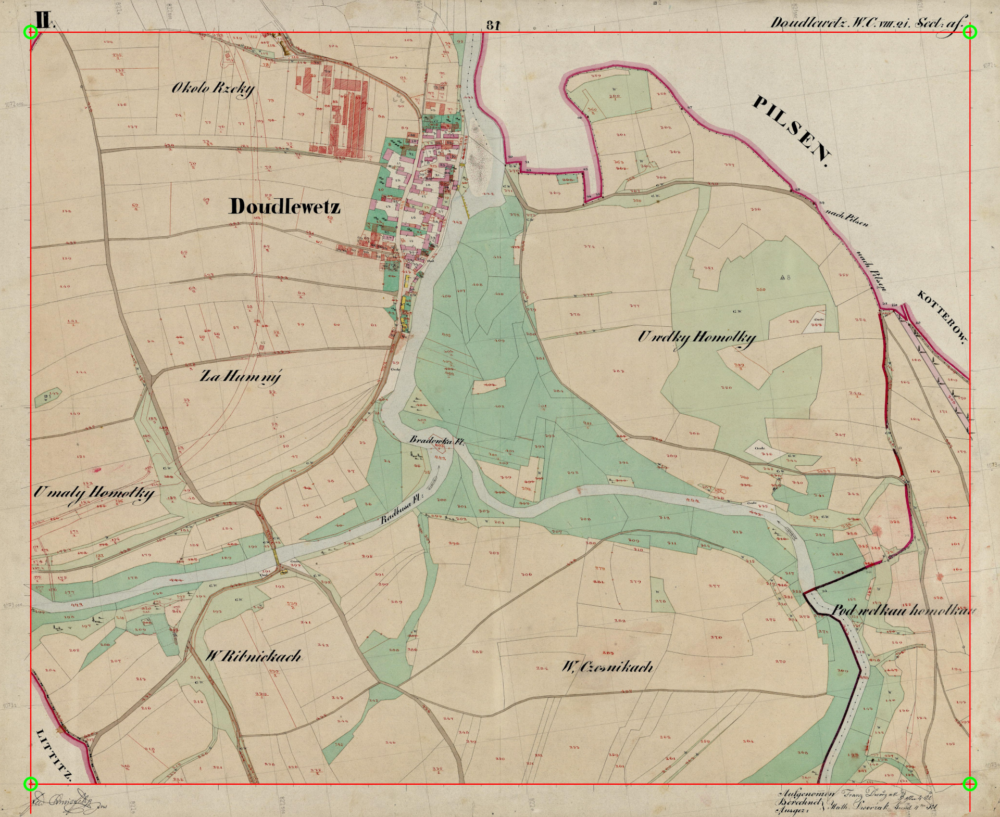

# kiv-zvi

- usage: `python ./console_historical_map_border_detection.py`

```
[-h]
-i INPUT_DIRECTORY_PATH
-o OUTPUT_DIRECTORY_PATH
[--min_longest_liner_means_percentile MIN_LONGEST_LINER_MEANS_PERCENTILE]
[--min_longest_liner_extremes_percentile MIN_LONGEST_LINER_EXTREMES_PERCENTILE]
```

